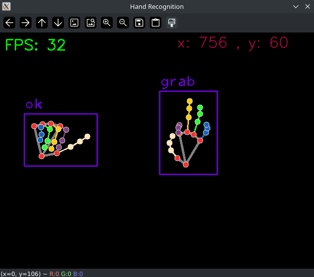

# HandGestures

Python library that makes it easy to create and detect custom gestures using mediapipe.

## Example Image



(the image is using the 'floating_mouse.py' example with the debug option '_blank_frame=True')

## Example Code

```python
# Import the needed classes
from hand_gestures import Condition, GestureBuilder, GestureHandler

# First define a list of gestures
class Gestures:
    NONE = "none"
    FIST = "fist"
    GRAB = "grab"
    OK = "ok"
    PINCH = "pinch"
    TWO_UP = "two up"


# Then create the gesture handler (this will use the camera)
handler = GestureHandler(0)


# This function is an example for a callback
def callback_func(callback_dict):
    print(
        f"1 - Hand: {callback_dict[0]['hand']}, Distance: {callback_dict[0]['distance']}, Condition Median Point: {callback_dict[0]['condition_median_point']}"
    )

# This callback will be used as the main callback and it is called on every frame
def main_callback_func(hand, detected_gestures, hand_scale, hand_positions):
    # Using 'detected_gestures' you can set which gesture is being detected
    # (this may look redundant but it is needed as sometimes multiple gestures are detected at once)
    if not detected_gestures:
        handler.set_gesture(hand, Gestures.NONE)
        return

    if Gestures.OK in detected_gestures:
        # Here, FIST takes priority over OK (if both are present)
        if Gestures.FIST in detected_gestures:
            handler.set_gesture(hand, Gestures.FIST)
        else:
            handler.set_gesture(hand, Gestures.OK)

    elif Gestures.GRAB in detected_gestures:
        handler.set_gesture(hand, Gestures.GRAB)

    elif Gestures.PINCH in detected_gestures:
        handler.set_gesture(hand, Gestures.PINCH)

    elif Gestures.TWO_UP in detected_gestures:
        handler.set_gesture(hand, Gestures.TWO_UP)

# Then define all the gestures by using conditions
# (coordinates are in screen distance and are normalized from 0.0 to 1.0)
ok = GestureBuilder(Gestures.OK, [Condition(0, [8, 12, 16, 20], 0.15)])
# The structure is GestureBuilder(gesture name, [list of conditions])
# Each condition can have many settings but the required ones are:
# landmark1, landamark2, distance (landmark2 can be a list)

# A visual landmark cheatsheet can be found here:
# https://mediapipe.dev/images/mobile/hand_landmarks.png

fist = GestureBuilder(Gestures.FIST, [Condition(4, 6, 0.05)])

grab = GestureBuilder(
    Gestures.GRAB, [Condition(4, 8, 0.05, hand="Left")], callback=callback_func
)

pinch = GestureBuilder(Gestures.PINCH, [Condition(4, 12, 0.05, hand="Right")])

two_up = GestureBuilder(
    Gestures.TWO_UP,
    [Condition(4, [16, 20], 0.1), Condition(8, 12, 0.05, invert_check=True)],
)

# Finally, start the running loop with all of your gestures (blocking)
handler.init([fist, ok, grab, pinch, two_up], main_callback_func)
```
